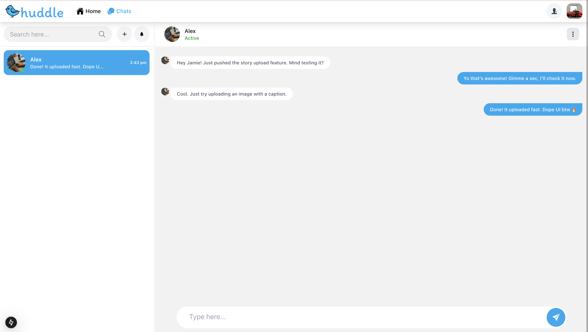
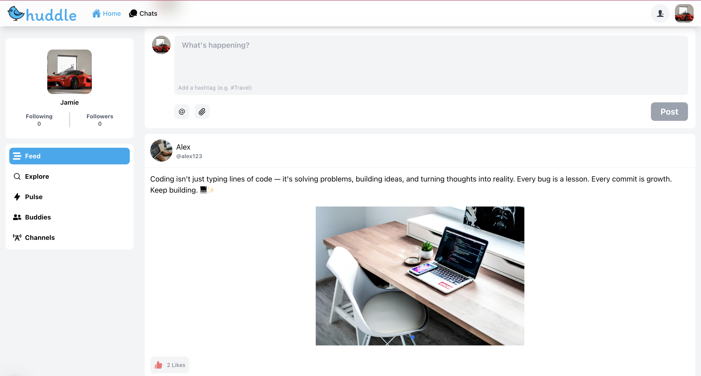

  

<h1 align="center">💬 Huddle - Social Media</h1>

  A real-time social media platform built with Next.js, Express, and Socket.io — built for sharing, chatting, and connecting. ⚡

---

## 🚀 Features

- 💬 **Real-time Chat**  
  One-on-one and group messaging powered by Socket.io for instant delivery.

- 📝 **Post Sharing**  
  Share text, images, and videos. Interact through likes, comments, and shares.

- 🙋‍♂️ **User Profiles**  
  Customize your avatar, bio, and see your activity.

- 📱 **Responsive Design**  
  Seamless UI across mobile, tablet, and desktop.

- 🔔 **Live Notifications**  
  Alerts for new messages, likes, and interactions.

- 🔒 **Authentication**  
  JWT + cookie-based secure login & middleware session handling.

- 🧵 **Public & Private Channels**  
  Create open communities or private spaces to share ideas.

- 🔐 **Google OAuth Integration**  
  Sign up and log in with Google for a faster, secure authentication experience.

---

## 🛠️ Tech Stack

| Layer         | Technology                                 |
| ------------- | ------------------------------------------ |
| 🎨 Frontend   | Next.js, React, Chakra UI, Tailwind CSS    |
| 🧠 Backend    | Node.js, Express                           |
| ⚡ Real-time  | Socket.io                                  |
| 🗃️ Database   | MongoDB (Mongoose)                         |
| 🛡️ Auth       | JWT, Cookies, **Google OAuth**, Middleware |
| 🖼️ Uploads    | Multer                                     |
| 💅 UI Styling | Chakra UI, Tailwind, shadcn/ui             |

---

## 📸 Screenshots

>   
> 

---

## 🧠 What I Learned

- 🔌 Implementing **Google OAuth** with Passport.js & cookies
- Real-time WebSocket communication (Socket.io)
- Cross-origin authentication using secure cookies & middleware
- Clean UI/UX with Chakra UI + shadcn/ui
- Modular full-stack architecture using Next.js + Express

---

## 🌐 Try It Out

Check the code:

- 👉 [Frontend Repo](https://github.com/gritik418/Huddle)
- 👉 [Backend Repo](https://github.com/gritik418/Huddle-Server)

---

## 📩 Contact

Wanna connect or hire me? Let’s talk!  
📧 [gritik418.dev@gmail.com]  
🔗 [LinkedIn](https://www.linkedin.com/in/ritik-gupta-849680251/)
